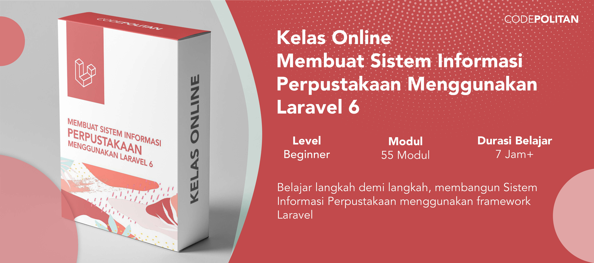

# Source Code Belajar Membuat Aplikasi Web Perpustakaan dengan Laravel

Dengan mengikuti kelas online ini, kamu akan belajar bagaimana cara membuat sebuah aplikasi web perpustakaan dengan Laravel dari halaman depan, dashboard administrator, serta proses pinjam meminjam buku, bahkan hingga manajemen keterlambatan.

Ketuk gambar untuk mulai belajar.
